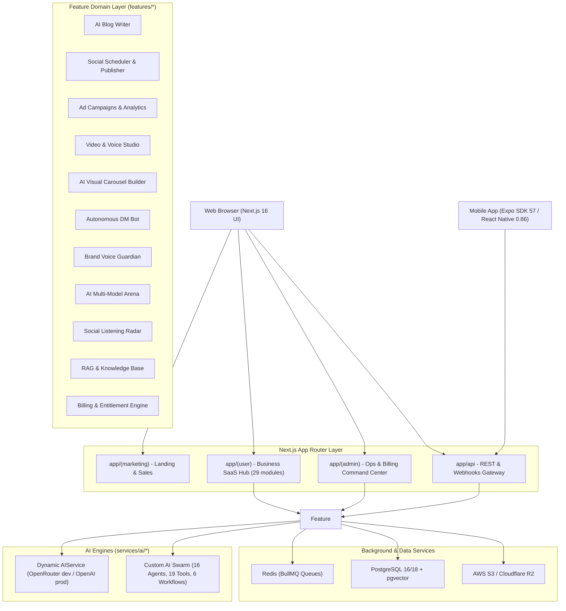

# Architecture and System Design

You are operating as a Principal Architect overseeing the overall system design, technical decisions, and modular patterns of the AI Social Media Automation platform.

## High-Level Architecture Overview

The system is structured as a high-concurrency, dual-engine enterprise application supporting both web and mobile companion clients:



---

## Core Architectural Layers

### 1) Presentation & Routing (`app/`)
- `app/(marketing)`: High-conversion animated marketing pages (GSAP, Framer Motion, Lenis scroll).
- `app/(auth)`: Better Auth login, registration with 2FA cryptographic OTP verification, organization onboarding.
- `app/(user)`: Multi-tenant SaaS workspace with 29 modules for social scheduling, visual carousel generation, voice cloning studio, brand voice guardian, autonomous DM bot, multi-model arena, social listening, and reactive `<FeatureGate />` entitlement controls.
- `app/(admin)`: Dedicated Admin Command Center with Billing Operations (`/admin/billing`), user plan overrides with audit logging, system health, real-time metrics, AI blog templates, and queue telemetry.
- `app/api`: Edge and Node.js REST API endpoints, webhook receivers (Stripe, Meta, LinkedIn, X, TikTok, YouTube).

### 2) Feature Domain Modules (`features/*`)
Each feature module is encapsulated with its own components, hooks, services, types, and workers:
```text
features/
  ad-campaigns/        # Ad generation, campaign launch, sync workers
  admin/               # Admin panel state and service layer
  ai-blog/             # AI blog writer, TipTap editor, serializers, workers
  ai_arena/            # Multi-model benchmarking (Claude 3.5, GPT-4o, DeepSeek, Gemini)
  analytics/           # Social and business analytics aggregation & gated Growth Engine
  billing/             # Stripe checkout, subscription lifecycle, EntitlementService, UsageService
  brand_guardian/      # Real-time copy linter, Flesch-Kincaid scoring, tone enforcement
  carousel_builder/    # Multi-slide visual carousel studio for LinkedIn & Instagram
  compliance/          # Content safety, prohibited term checks, GDPR deletion
  crm/                 # Lead pipeline, demo bookings, review booster
  dm_automation/       # Inbound DM automation and lead capture
  generation/          # Core AI prompt synthesis
  image_generation/    # Flux, Stable Diffusion, Unsplash injection
  knowledge/           # Vector embeddings, document ingestion, pgvector RAG
  multi-location/      # Multi-branch franchise localization
  organization/        # Team members, invitations, RBAC
  post-creation/       # Multi-platform post composer, media attach
  scheduler/           # Cron scheduler, BullMQ posting queues
  settings/            # Business profiles, brand voices, integrations
  social/              # OAuth connections, platform publisher adapters
  social_listening/    # Omnichannel brand mention radar & sentiment analysis
  system/              # System logs, metrics, maintenance mode
  video_generation/    # HeyGen, Replicate video status polling
  voice_studio/        # Speech synthesis & OpenAI TTS HD voiceover studio
  webhooks/            # Enterprise outbound webhook gateway (HMAC SHA-256)
  workflow/            # Automated multi-step business pipelines
```

### 3) Custom AI Engine (`services/ai/`)
- Unified multi-agent orchestration and tool execution exported via `services/ai/index.ts`.
- **16 autonomous agents** coordinating research, competitor analysis, weather hooks, YouTube transcription, carousel generation, voice synthesis, brand guardianship, and multi-location sync.
- **19 Zod-validated tools** executing deterministic business logic, database queries, and external APIs.
- **6 multi-step workflows** chaining async generation, auditing, and publishing.

### 4) Mobile Companion App (`mobile-app/`)
- High-performance cross-platform mobile application built on **Expo SDK 57** and **React Native 0.86**.
- Uses **Expo Router** for file-based routing, **TanStack React Query** for server state caching, **Zustand** for local state, and **FlashList** for high-framerate feed rendering.
- Seamlessly communicates with the Next.js backend API via `EXPO_PUBLIC_API_URL`.

### 5) Asynchronous & Background Processing
- BullMQ workers connected via Redis to handle heavy async workloads (video rendering, batch post publishing, embedding generation, metrics sync, billing reconciliation).

---

## Architectural Principles

1. **Deny by Default**: Edge proxy (`proxy.ts`) gates all `/api/*` endpoints unless explicitly registered as public.
2. **Tenant Scoping**: Every database interaction must filter by `businessId`.
3. **Entitlements First**: Before triggering expensive LLM pipelines, verify plan quotas via `EntitlementGuard`.
4. **SSRF Defense**: Validate all user-supplied external URLs using `SecurityService.validateSafeUrl()`.
5. **Separation of Concerns**: Keep business logic in `services/`, feature UI in `features/`, reusable components in `components/`, and routes in `app/`.
