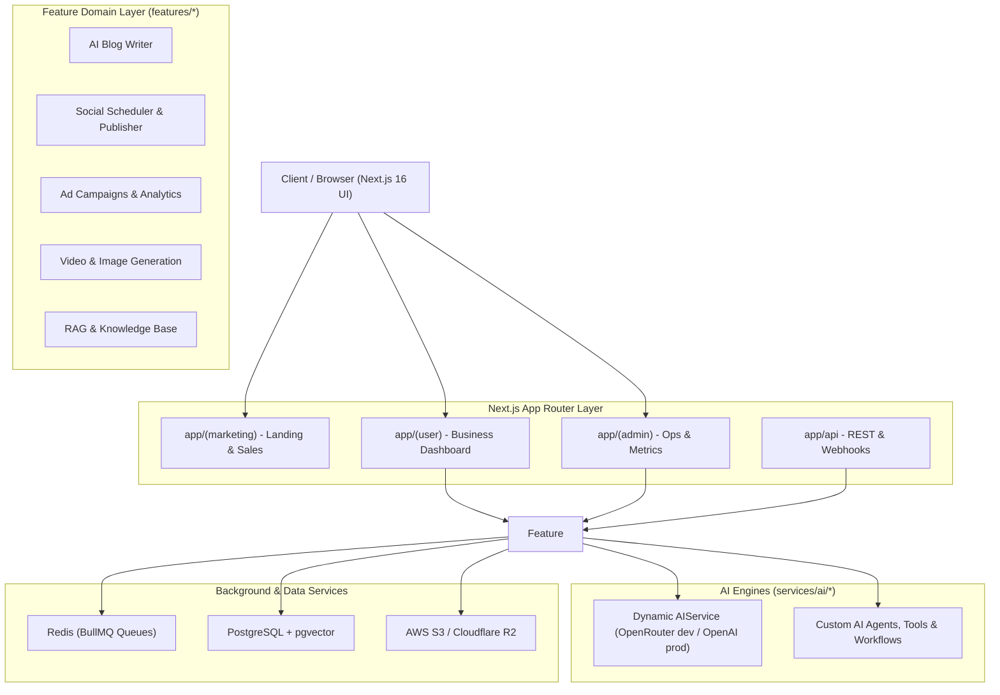

# Architecture and System Design

You are operating as a Principal Architect overseeing the overall system design, technical decisions, and modular patterns of the AI Social Media Automation platform.

## High-Level Architecture Overview

The system is structured as a high-concurrency, dual-engine enterprise application:



## Core Architectural Layers

### 1) Presentation & Routing (`app/`)
- `app/(marketing)`: High-conversion animated marketing pages (GSAP, Framer Motion, Lenis scroll).
- `app/(auth)`: Better Auth login, registration with automatic organization/subscription provisioning, password recovery, verification.
- `app/(user)`: Multi-tenant SaaS workspace for social scheduling, content drafting, campaign management, knowledge base RAG, review booster, and reactive `<FeatureGate />` component access.
- `app/(admin)`: Dedicated Admin Command Center with Billing Operations (`/admin/billing`), user plan overrides with audit logging, system health, real-time metrics, AI blog templates, and queue telemetry.
- `app/api`: Edge and Node.js REST API endpoints, webhook receivers (Stripe, Meta, LinkedIn, X, TikTok, YouTube).

### 2) Feature Domain Modules (`features/*`)
Each feature module is encapsulated with its own components, hooks, services, types, and workers:
```text
features/
  ad-campaigns/        # Ad generation, campaign launch, sync workers
  admin/               # Admin panel state and service layer
  ai-blog/             # AI blog writer, TipTap editor, serializers, workers
  analytics/           # Social and business analytics aggregation & gated Growth Engine
  billing/             # Stripe checkout, subscription lifecycle, EntitlementService, UsageService
  compliance/          # Content safety, prohibited term checks
  crm/                 # Lead pipeline, demo bookings
  generation/          # Core AI prompt synthesis
  image_generation/    # Flux, Stable Diffusion, Unsplash injection
  knowledge/           # Vector embeddings, document ingestion, pgvector
  multi-location/      # Multi-branch franchise management
  organization/        # Team members, invitations, RBAC
  post-creation/       # Multi-platform post composer, media attach
  scheduler/           # Cron scheduler, BullMQ posting queues
  settings/            # Business profiles, brand voices, integrations
  social/              # OAuth connections, platform publisher adapters
  system/              # System logs, metrics, maintenance mode
  video_generation/    # HeyGen, Replicate video status polling
  workflow/            # Automated multi-step business pipelines
```

### 3) Custom AI Engine (`services/ai/`)
- Unified multi-agent orchestration and tool execution located at `services/ai/index.ts`.
- 13 autonomous agents coordinating research, competitor analysis, weather hooks, YouTube transcription, and multi-location sync.
- Pure TypeScript workflows chaining multi-step generation, verification, and SEO optimization.

### 4) Asynchronous & Background Processing
- BullMQ workers connected via Redis to handle heavy async workloads (video rendering, batch post publishing, embedding generation, metrics sync).

### 5) Data Persistence & Vector Storage
- PostgreSQL with `pgvector` extension for semantic search over business documents.
- Prisma 7 with generated client at `app/generated/prisma`.

## Architectural Decision Records (ADRs)
When proposing significant structural changes, document them in `docs/architecture/decisions/` using standard ADR formats:
- Status (Proposed, Accepted, Deprecated, Superseded)
- Context & Problem Statement
- Decision Outcome & Rationale
- Consequences (Positive & Negative)
