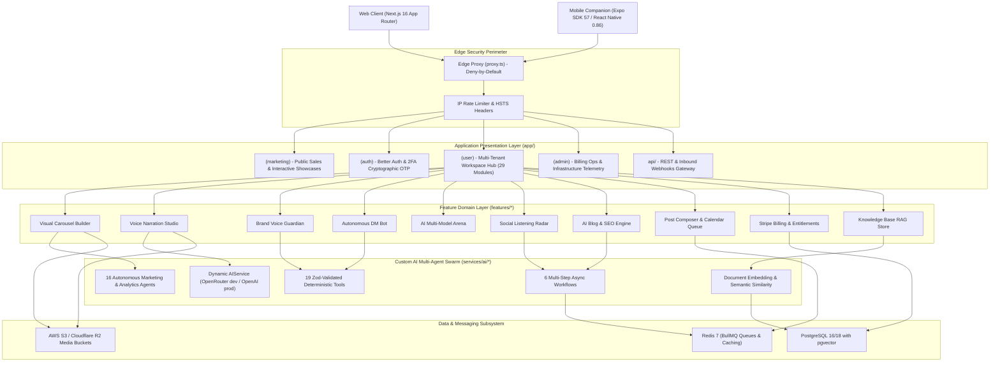

# SocialAI System Architecture 🏛️

This document outlines the end-to-end software architecture, component boundaries, data flows, and design principles of the **SocialAI** enterprise social media automation and multi-agent marketing platform.

---

## 1. High-Level Architectural Topology

SocialAI operates as a high-concurrency, dual-engine distributed system serving both responsive web applications and cross-platform mobile companions.

---

## 2. Presentation & Routing Layer (`app/`)

The web frontend is powered by **Next.js 16 (App Router)** and **React 19**, organized into dedicated route groups:

| Route Group | Purpose | Key Modules |
| :--- | :--- | :--- |
| `app/(marketing)` | Public high-conversion marketing pages | Hero with parallax, GSAP-driven card cascades, dynamic interactive tool showcase, live pricing switcher |
| `app/(auth)` | Identity and onboarding | Split-screen authentication, 6-digit cryptographic numeric OTP registration, password strength meter, email verification |
| `app/(user)` | Multi-tenant SaaS workspace | **29 domain modules**: `/dashboard`, `/posts`, `/schedule`, `/contents`, `/carousels`, `/voice`, `/guardian`, `/dm-automation`, `/arena`, `/listening`, `/studio`, `/multi-location`, `/engagement`, `/reviews`, `/settings/*` |
| `app/(admin)` | Operations and telemetry | Executive Billing Command Center (`/admin/billing`), user management with manual plan overrides and audit notes, queue status, system logs |
| `app/api` | Edge and Node.js REST API | REST handlers for all UI workflows, Stripe webhooks, social callbacks, `/api/metrics`, `/api/health` |

### Shared Component Architecture
- **Global Modal Orchestrator ([`GlobalModals`](file:///Users/taha/projects/ai_social_media_automation/components/common/GlobalModals.tsx))**: Centrally mounted in `app/(user)/layout.tsx`, handling content creation, scheduling, member invitations, and detail dialogs without prop-drilling.
- **Animated Theme Engine ([`ThemeToggleAnimated`](file:///Users/taha/projects/ai_social_media_automation/components/common/ThemeToggleAnimated.tsx))**: Uses the CSS View Transitions API (`circle-blur` radial expand) coupled with `next-themes` and `localStorage`.
- **Dynamic Feature Gating ([`FeatureGate`](file:///Users/taha/projects/ai_social_media_automation/components/billing/FeatureGate.tsx))**: Reactively verifies workspace plan entitlements via `/api/billing/entitlements` to unlock features (`scheduling`, `advanced_analytics`, `api_access`) or display glassmorphic upgrade prompts.

---

## 3. Mobile Companion Architecture (`mobile-app/`)

The mobile companion application provides cross-platform iOS and Android access using **Expo SDK 57** and **React Native 0.86**:

- **File-Based Routing**: Structured in `mobile-app/src/app/` using **Expo Router**.
- **Data Caching**: Managed by **TanStack React Query** (`@tanstack/react-query`) with automated query invalidation and optimistic updates.
- **Client & Session State**: **Zustand** stores handle active business workspace, auth tokens, and filter presets.
- **Virtualized Performance**: Feeds and post lists utilize **FlashList** (`@shopify/flash-list`) to achieve seamless 60/120fps scrolling.
- **API Connectivity**: Communicates with the Next.js backend via `EXPO_PUBLIC_API_URL` (`http://localhost:3000` for iOS simulator, `http://10.0.2.2:3000` for Android emulator).
- **Offline Resilience**: Built-in mock data fallback triggered when `EXPO_PUBLIC_ENABLE_OFFLINE_MOCK=true`.

---

## 4. Custom AI Multi-Agent Swarm (`services/ai/`)

The platform features a proprietary multi-agent swarm in pure TypeScript:

### 16 Autonomous Agents (`services/ai/agents/`)
1. **`analytics.agent.ts`**: Audits account growth, engagement velocity, and ROI attribution.
2. **`blog.agent.ts`**: Ghostwrites structured, long-form articles with SEO audits.
3. **`brand-guardian.agent.ts`**: Real-time copy linter analyzing readability, character caps, and forbidden terms.
4. **`carousel.agent.ts`**: Generates multi-slide LinkedIn PDF carousels and Instagram swipe decks.
5. **`competitor.agent.ts`**: Scans competitor posting cadences and engagement strategies.
6. **`dm-automation.agent.ts`**: Inbound conversation intent classifier and lead capture generator.
7. **`engagement.agent.ts`**: Crafts contextual social comment and discussion replies.
8. **`multi-location.agent.ts`**: Coordinates tone, schedules, and localizations for franchise locations.
9. **`post-creation.agent.ts`**: Multi-platform post copy synthesis with hashtag recommendation.
10. **`review-booster.agent.ts`**: Converts positive customer feedback into social proof snippets.
11. **`social-listening.agent.ts`**: Omnichannel brand monitoring and sentiment trend detection.
12. **`template.agent.ts`**: Synthesizes 90-day industry-specific growth blueprints.
13. **`trend-event.agent.ts`**: Contextual hook generator based on local calendars and holidays.
14. **`voice.agent.ts`**: Script composition and voice persona timbre configuration.
15. **`weather.agent.ts`**: Generates contextual marketing hooks linked to local weather conditions.
16. **`youtube.agent.ts`**: Transcribes video content and extracts repurposed social post variants.

### 19 Zod-Validated Tools (`services/ai/tools/`)
Tools execute deterministic logic, database queries, and external APIs with strict input and output Zod validation schemas.

### 6 Multi-Step Workflows (`services/ai/workflows/`)
- `blog.workflow.ts`: Topic research -> outline -> drafting -> SEO scoring -> image injection.
- `carousel-publishing.workflow.ts`: Topic synthesis -> slide composition -> theme styling -> validation.
- `post-publishing.workflow.ts`: Copy drafting -> brand guardian audit -> queue dispatch.
- `social-listening.workflow.ts`: Mention scanning -> sentiment calculation -> executive brief.
- `voice-narration.workflow.ts`: Script drafting -> readability audit -> audio synthesis dispatch.
- `weather.workflow.ts`: Weather fetch -> promotion synthesis -> scheduled post generation.

---

## 5. Background Processing & Asynchronous Queues

Async tasks are decoupled using **BullMQ** and **Redis**:

| Queue Name | Worker Process | Function |
| :--- | :--- | :--- |
| `social-posting-queue` | `features/scheduler/workers/posting.worker.ts` | Dispatches posts to social platform APIs with jitter |
| `content-generation-queue`| `features/scheduler/workers/content-generation.worker.ts` | Batched AI copywriting and variant synthesis |
| `blog-generation-queue` | `features/ai-blog/workers/blog-generation.worker.ts` | Multi-step blog generation and SEO audit pipelines |
| `image-generation-queue`| `features/image_generation/workers/image-generation.worker.ts` | Flux Pro and Stable Diffusion asset synthesis |
| `video-status-queue` | `features/video_generation/workers/video-status.worker.ts` | Async polling for HeyGen and Replicate video rendering |
| `knowledge-indexing-queue`| `features/scheduler/workers/knowledge.worker.ts` | Document chunking and `pgvector` embedding generation |
| `email-notification-queue`| `features/scheduler/workers/emailWorker.ts` | Transactional email delivery and 2FA OTP fallback |
| `social-sync-queue` | `features/scheduler/workers/social.worker.ts` | Synchronizes follower counts and post analytics |

---

## 6. Data Storage & Schema Organization

- **Database**: PostgreSQL 16/18 with the `pgvector` extension.
- **ORM**: Prisma 7 (`@prisma/client` 7.9.1) with modular models in `prisma/models/`:
  - `ad.prisma`, `auth.prisma`, `billing.prisma`, `blog.prisma`, `business.prisma`, `crm.prisma`, `knowledge.prisma`, `social.prisma`, `system.prisma`, `video.prisma`, `workflow.prisma`.
- **RAG & Vector Retrieval**: 1536-dimensional embeddings stored in `Unsupported("vector")` columns in `KnowledgeChunk` and queried via raw SQL cosine distance queries (`<->` or `<=>`).
- **Object Storage**: AWS S3 or Cloudflare R2 presigned URLs with binary magic byte validation.

---

## 7. Security Perimeter & Defensive Architecture

1. **Deny-by-Default Edge Proxy (`proxy.ts`)**: All `/api/*` endpoints require verified Better Auth sessions or admin tokens unless explicitly listed in `PUBLIC_PREFIXES`.
2. **Multi-Tenant Isolation**: Enforces mandatory `businessId` tenancy checks on every Prisma query. Client-supplied IDs are never trusted blindly.
3. **SSRF Pre-Validation**: Every user-supplied URL is validated via `SecurityService.validateSafeUrl()` before executing `fetch()`, blocking private RFC1918 subnets and cloud metadata endpoints (`169.254.169.254`).
4. **Binary Magic Byte Inspection**: Uploaded assets are checked for valid MIME magic numbers (PNG, JPEG, WebP, MP4) rather than relying on file extensions.
5. **Two-Factor Authentication**: Cryptographic 6-digit numeric OTPs with 2-minute expiry, rate-limited resend cooldowns, and direct SMTP delivery.
6. **Automated Cybersecurity Regression Tests**: Verified continuously via `lib/__tests__/cybersecurity-regression.test.ts`.
